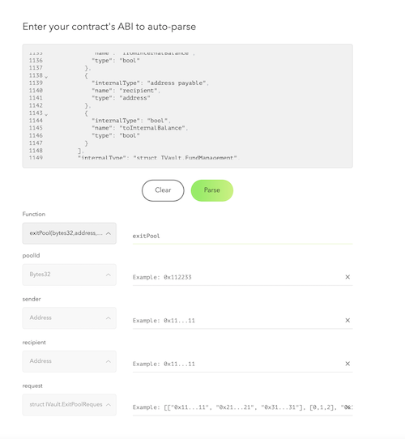
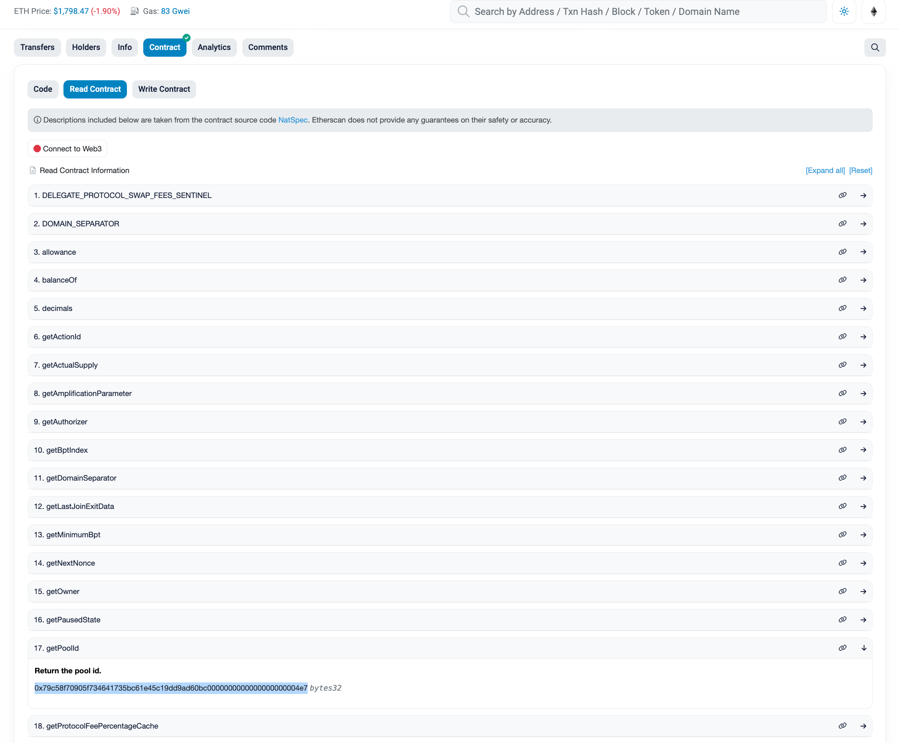
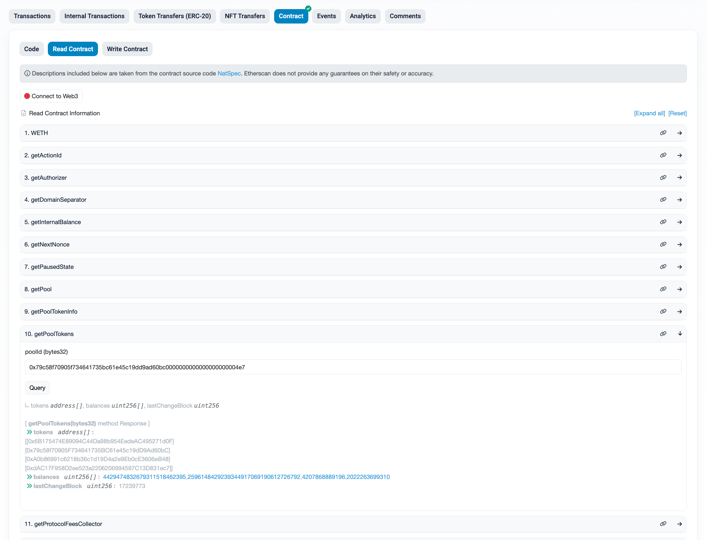
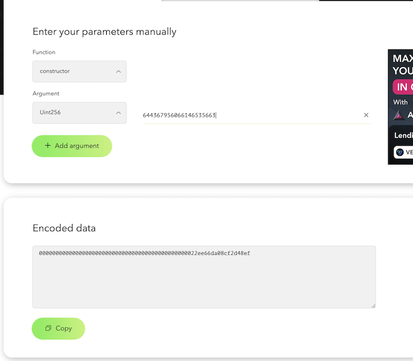
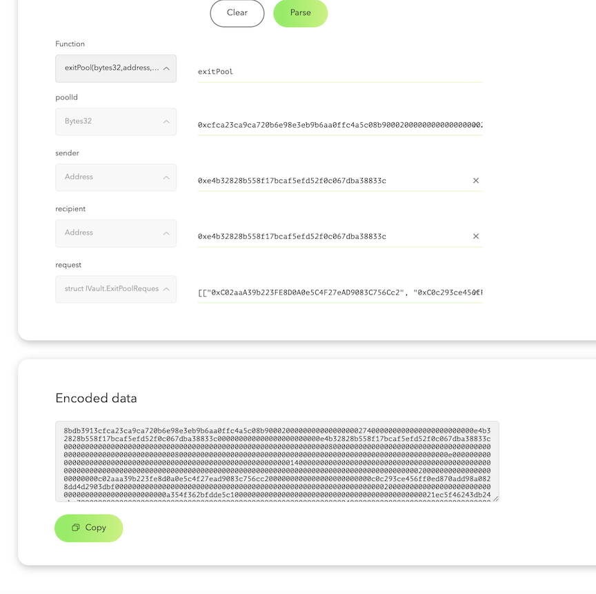
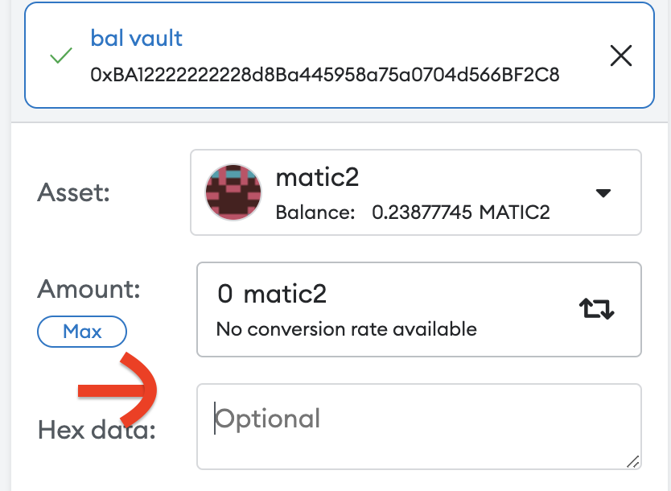

This guide should serve to allow users to create their own exit pool transactions for composable stable pools manually in the event of the ui being inaccessible.  

Note: If your BPT is deposited into a gauge earning rewards (or deposited into Aura), you will need to unstake or withdraw from there first. 

0x74f3b009
Let's first familiarize ourself with what exiting a composable stable pool looks like. 
https://etherscan.io/tx/0x45c8ad845b03bb5564ed481bc675649a627bb88ddda8efa9157fd7df87d2c126

Go to the Balancer vault address on etherscan and scroll down until you see "contract abi".  Copy this and go to https://abi.hashex.org/ select autoparse, and paste the abi into the text box and click parse.  Then under "function" select "exitPool"
https://etherscan.io/address/0xba12222222228d8ba445958a75a0704d566bf2c8#code

It should look like this 

The exitpool transaction is made up of four parts, `poolId, sender, recipient, request`

**poolId**: You can find this by going to the LP token contract address, going to "contract" tab on etherscan then "read contract" and item 12 should be getPoolId, which should look like this `0x79c58f70905f734641735bc61e45c19dd9ad60bc0000000000000000000004e7`

**Sender**: this is your address

**Recipient**: this is also your address

*And finally, the most complex one,*  

## **Request** 
**Request** is a struct made up of `address[],uint256[],bytes,bool` corresponding with:

`[contract addresses, amounts, userData, toInternalBalance]`

it is fine if you don't know what this means, I will show you how to encode it. 

Let's break down each part of the request.  Get a text file and fill out these parameters as we go and we will put it together at the end.  

### **address[]** Contract addresses
this is an array of **contract addresses for the assets** in the pool. Please note a key difference for composable stable pools is that the pool token itself is held within the pool. This is because tokens are minted during pool initialization. There will always be n+1 tokens in these pools, so if pool holds 3 assets, it will hold 4 contract addresses, the additional being it's own. 

*If you already know the asset contract addresses, you can skip this part.*
Go to the balancer vault on etherscan, and go to contract>read contract then find 10. getPoolTokens.  Input the poolid and hit query and it should return the array of tokens like this 

It should look like this 
`["0x6B175474E89094C44Da98b954EedeAC495271d0F",
"0x79c58f70905F734641735BC61e45c19dD9Ad60bC",
"0xA0b86991c6218b36c1d19D4a2e9Eb0cE3606eB48",
"0xdAC17F958D2ee523a2206206994597C13D831ec7"]`

## **Important note** 
the addresss above must be sorted lowest to highest, it terms of leading hexadecimal digits.  with 1 < 5< a < f.  In this case 0xC02 is less than 0xC0c.  If you get BAL#102 this is whats causing it.  

### **uint256[]** Amounts
is where we will be encoding our **amounts out**.  You must be aware of the decimals on the token (can be found on the token page on etherscan) and adjust accordingly per asset.  You can find out how much underlying assets your pool tokens are worth on the balancer ui, and wallet viewers like debank, zapper, etc.  Note that you have have to apply slippage at this stage so if you have a slippage of 1% (remember if it goes outside this range before being executed the transaction will fail, wasting precious gas), subtract 1% from both assets.

I'll work off the same example from above, which used the amounts 
`["0","0","395964108006",0"]`

Which normalized from 18 decimals for DAI and the BPT is 0 and 0. For USDC and USDT the assets are normalized by 6 decimals, in this case 0 USDT and 395,964.108006 USDC are requested.  Note that the order of this array corresponds with the order of assets in the above address[] array.

## Incomplete below here

### **bytes** **userData**
This data basically describes 
1. what exit type it is (single asset in this case) and 
2. how much BPT to the user is sending back to the vault in exchange for the underlying assets.

It looks like this

`0x000000000000000000000000000000000000000000000000000000000000000000000000000000000000000000000000000000000000543c34ab26876b7b96140000000000000000000000000000000000000000000000000000000000000001`

Lets split them up by part 

`0000000000000000000000000000000000000000000000000000000000000001`

This is the exit type.  Simply leave this as is for proportional exits.  

`000000000000000000000000000000000000000000000022ee66da08cf2d48ef`

Is our bpt amount in hex.  A hex to decimal conversion shows this value to be `644367956066146535663` or `644.367956066` adjusted for 18 decimals (which all bpt are).

To encode this value, go to https://abi.hashex.org/ and select Add Argument and select UINT256 then type in your BPT amount 

You can get your BPT amount by going to the pool token contract, clicking contract> read contract and going to balanceOf() and inputting your address.  Whatever it returns is how much BPT you hold in 18 decimals.  Input that into the site above and copy the resulting "encoded data" at the bottom. It should look like this

`000000000000000000000000000000000000000000000022ee66da08cf2d48ef`

Now we put these two parts together with a 0x at the beginning so
`0x` + `0000000000000000000000000000000000000000000000000000000000000001` + `000000000000000000000000000000000000000000000022ee66da08cf2d48ef` = 

`0x0000000000000000000000000000000000000000000000000000000000000001000000000000000000000000000000000000000000000022ee66da08cf2d48ef`

Which is our **userData**

### **bool** toInternalBalance

The final parameter relates to whether the resulting output is to internal balances.  You can just set it to `false` if you don't intend to use internal balances (which you probably don't).

So now we put these four pieces together in an array like this 

`[address[],uint256[],bytes,bool]`

So the **Request** looks like this 

'[["0x6B175474E89094C44Da98b954EedeAC495271d0F","0x79c58f70905F734641735BC61e45c19dD9Ad60bC","0xA0b86991c6218b36c1d19D4a2e9Eb0cE3606eB48","0xdAC17F958D2ee523a2206206994597C13D831ec7"],["0","0","395964108006","0"],"0x000000000000000000000000000000000000000000000000000000000000000000000000000000000000000000000000000000000000543c34ab26876b7b96140000000000000000000000000000000000000000000000000000000000000001",false]'

Now go back to the hashex site with the exitPool function selected and lets fill in the data.  We already explained poolId, sender and recipient.  Now copy the entire Request struct starting with the opening [ and ending with the closing ] into the request struct box.  It should look like this 

Now that the transaction is created, we now have to send it.  In order to send custom transactions through metamask, we first must go to settings>advanced>"show hex data" and enable it.  Next go to send, and with the "to" address being the balancer vault `0xBA12222222228d8Ba445958a75a0704d566BF2C8`

In the "hex data" section on metamask, input the "encoded data" at the bottom of the above image.  Note that if there are any errors in the tx construction, it will say the transaction is likely to fail.  If its only estimating 21000 gas, that means the transaction will fail.  

Assuming everything is right, sending this transaction will withdraw from the weighted pool.  

